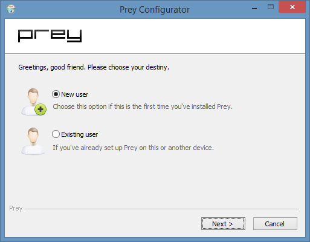
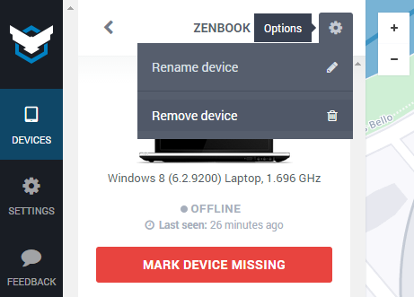

* Table of Contents
{:toc}
* * *

This article will guide you on adding the following devices to your Prey account:

1. Laptops
2. Android phones and tablets
3. iPhones, iPads

# Adding Devices

The protect all your devices with Prey it's as easy as 1-2-3. In a nutshell, you just have to:

1. Visit our [downloads page][download] *from the device you need to add to your account*.
2. Download and install Prey into the device.
3. Run the setup wizard using your existing Prey email address and password. In case you don't have an account you can create one here.

### Important

**You can't add devices that you can't access.** It's impossible to register to your account a computer or phone already stolen, unless you previously had some kind of remote desktop software, such as Chrome Remote Desktop or LogMeIn.

(Looking for Prey unattended install methods for mass deployment? [Check this article](prey-unattended-install-for-mass-deployment.md).)

## 1. Prey for Laptops

After you download and run the Prey installer, and choose your language, you'll see a screen asking you to choose to create a new Prey account, or to add this device to an existing one. If you're reading this guide then you'll probably have a Prey account already :)

The device will be added to your account after you enter your Prey email and password, and finish the process, provided that you're connected to the internet. You'll get a success message, and you'll find the new computer on your [Prey account][prey-account].

In case there's any problem during the process, please check the last section of this article.

## 2. Prey for Android

The Prey installer for Android is distributed via [Google Play][google-play]. You can also find the links on our [downloads page][download], in case it's easier for you.

The process here is like installing any other Android app:

1. Click on the link or search the Google Play app on your device for *Prey Anti Theft*.
2. Install Prey on the device.
3. Enter your exiting Prey account's email and password, or create an account here.

Once the process is complete you'll find the phone or tablet on your [Prey account][prey-account].

**This can't be done remotely.** Even though you might be able to install Prey into your stolen device from Google Play on your browser, you also need to enter your Prey email and password into the app. This is impossible if you can't physically access the lost phone or tablet.

In case there's any problem during the process, please check the last section of this article.

## 3. Prey for iOS

The Prey installer for iPhones and iPads is distributed via the [AppStore][appstore]. You can also find the links on our [downloads page][download], in case it's easier for you.

The process here is like installing any other Android app:

1. Click on the link or search the AppStore app on your device for *Prey Anti Theft*.
2. Install Prey on the device.
3. Enter your exiting Prey account's email and password, or create an account here.

Once the process is complete you'll find the phone or tablet on your [Prey account][prey-account].

In case there's any problem during the process, please check the last section of this article.

******************************

# Troubleshooting and Known Issues

## Errors while installing Prey

### Windows

Prey handles the installation log on the `prey-install.log` file located in your temporal directory (commonly known as `%temp%`). To access that directory,

1. Hit the `Windows key` and `R` keys at the same time.
2. In that small screen that popped up enter `%temp%`
3. Hit enter.

Please search for the `prey-install.log`, open it on a text editor, and paste its output when you contact us from your Prey account.

Note: The `.log` could me missing from the file if you chose your operating system to hide file extensions.

### OS X

The Prey installer will only run on OS X 10.7 and newer. Snow Leopard or older versions of OS X don't have the required dependencies for the app to start. However, *you can still install Prey into older machines*. To do that please follow the [unattended install](prey-unattended-install-for-mass-deployment.md) method.

### Linux

Different distributions have different names for their packages. Please make sure that all required dependencies for Prey are installed. The easiest way to do this is to install the `DEB` package on Debian-based distributions, or the [npm](https://www.npmjs.org/package/prey) packages for yours.

## Errors after installing Prey

You won't be able to add a device to your account in case you reached your device quota. Free accounts can protect up to 3 devices, as well as the Prey Pro Personal plan. In case you need to protect more devices you can [subscribe](subscribe) to the Home plan or bigger, or delete existing devices from your account to make room for new ones.

## My problem is not listed

Please use the [contact form][contact-form] from your [Prey account][prey-account]. We're always glad to help.

[support-home]: /help "Prey Support"
[prey-account]: https://panel.preyproject.com/ "Prey account"
[download]: https://preyproject.com/download "Download Prey"
[recoveries]: https://preyproject.com/blog/cat/recoveries "Prey recovery stories"
[recommended-settings]: # "Prey recommended settings"
[sign-up]: https://panel.preyproject.com/signup "Signup to Prey"
[appstore]: https://itunes.apple.com/app/id456755037 "Prey for iPhone, iPad, and iPod"
[google-play]: https://play.google.com/store/apps/details?id=com.prey "Prey for Android"
[contact-form]: # "Prey contact"
[plans]: https://preyproject.com/plans "Prey Pro"
[subscribe]: https://panel.preyproject.com/settings/account "Subscribe to Prey"
[business]: https://preyproject.com/business/ "Prey for Business"
[education]: https://preyproject.com/education/ "Prey for Education"
[prey-node-releases]: https://github.com/prey/prey-node-client/releases
[admin-cmd]: https://www.youtube.com/watch?v=EohzkYPV6nI
[device-management]: https://panel.preyproject.com/settings/devices
