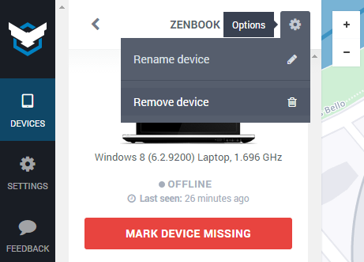

* Table of Contents
{:toc}
* * *

This page will answer four questions:

1. When and why you should delete a device from your account.
2. How to do it.
3. When you should **not** delete a device from your account.
4. How to re-add an accidentally deleted device.

# 1. When and why you should delete a device from your account

Prey plans include several features, in addition to *device slots*. Device slots mean how many computers and mobiles you can protect from the same account. For example, the Basic plan supports up to 3, and we can provide custom plans for up to a million, in case you need them. You usually won't need to delete devices, unless you need to free up device slots. For example, if:

- You no longer own a device.
- You reached your device quota, and want to delete a cheap phone to protect a new computer.
- You need to downgrade from a plan, and the new one has fewer device slots.
- A device broke and is no longer usable.

# 2. How to do it

Please note that Prey is a two-way service: the agent installed on your devices and your Prey account on the web to manage them. In case you decided to delete a phone, tablet, or computer, just make sure that you already [uninstalled the app from the device](uninstalling-prey.md), and then:

1. Log into your [Prey account][prey-account].
2. Click on the device you need to delete.
3. Click on the options gear next to the device's name.
4. Select **Remove Device**.

# 3. When you should **not** delete a device from your account

#### When your device is Missing

**Devices can't be undeleted**, which means that once you remove them from your account they're gone for good. As much as we'd like to, we can't help you track a phone or computer that is no longer on your account.

#### When you have trouble with Prey on the device

Removing the entry from your [Prey account][prey-account] won't unlock your screen, and won't certainly make any undesirable things to stop happening.

# 4. How to re-add an accidentally deleted device

The only way to add devices to your account is to reinstall Prey on them, and then run the configurator wizard. To know more about the process, please check this article on [how to uninstall Prey](uninstalling-prey.md), and this one on [how to add devices to your account](adding-devices-to-your-prey-account.md).

*********************

# Learn more

This is just the start. Please head to our [documentation][support-home] to learn more about Prey, solve common questions, and more awesome stuff.

[support-home]: /help "Prey Support"
[prey-account]: https://panel.preyproject.com/ "Prey account"
[download]: https://preyproject.com/download "Download Prey"
[recoveries]: https://preyproject.com/blog/cat/recoveries "Prey recovery stories"
[recommended-settings]: # "Prey recommended settings"
[sign-up]: https://panel.preyproject.com/signup "Signup to Prey"
[appstore]: https://itunes.apple.com/app/id456755037 "Prey for iPhone, iPad, and iPod"
[google-play]: https://play.google.com/store/apps/details?id=com.prey "Prey for Android"
[contact-form]: # "Prey contact"
[plans]: https://preyproject.com/plans "Prey Pro"
[subscribe]: https://panel.preyproject.com/settings/account "Subscribe to Prey"
[business]: https://preyproject.com/business/ "Prey for Business"
[education]: https://preyproject.com/education/ "Prey for Education"
